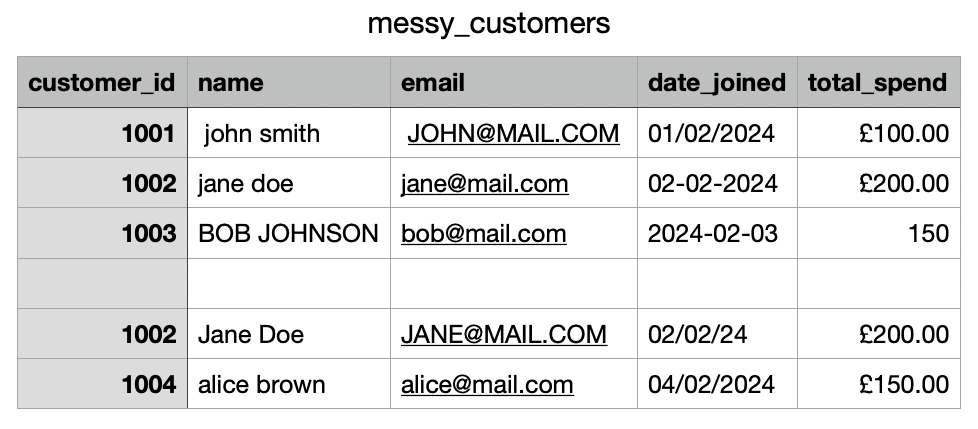
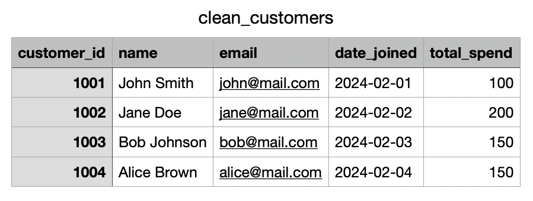
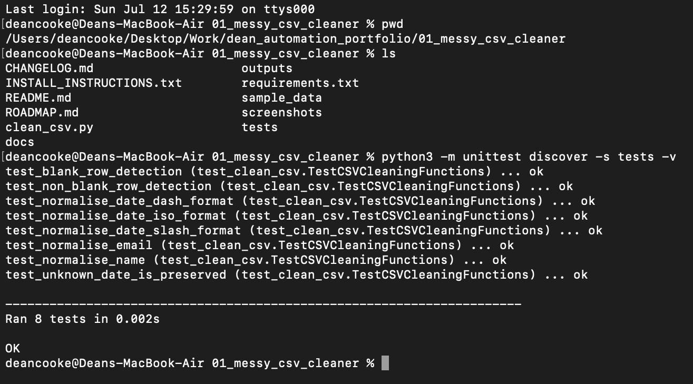

# Messy CSV Cleaner

A simple Python tool that turns inconsistent CSV data into a cleaner, more usable file.

## The Problem

Business data often arrives with issues such as:

- Duplicate records
- Blank rows
- Inconsistent capitalisation
- Mixed date formats
- Unnecessary currency symbols
- Inconsistent email formatting

Cleaning this manually is repetitive, slow, and easy to get wrong.

---

## The Solution

This script reads a messy customer CSV file, applies a set of cleaning rules, and exports:

- A cleaned CSV file
- A summary report
- Consistent names, emails, dates and spending values

---

## Example Transformation

### Before

```csv
customer_id,name,email,date_joined,total_spend
1001," john smith "," JOHN@MAIL.COM ","01/02/2024","£100"
1002,"jane doe","jane@mail.com","02-02-2024","£200"
1003,"BOB JOHNSON","bob@mail.com","2024-02-03","150"
,,,,
1002,"Jane Doe","JANE@MAIL.COM","02/02/24","£200"
```

### After

```csv
customer_id,name,email,date_joined,total_spend
1001,John Smith,john@mail.com,2024-02-01,100
1002,Jane Doe,jane@mail.com,2024-02-02,200
1003,Bob Johnson,bob@mail.com,2024-02-03,150
```

---

## Cleaning Rules

The current version:

- Removes fully blank rows
- Removes duplicate customer records
- Trims extra spaces
- Converts names to Title Case
- Converts emails to lowercase
- Standardises common date formats to `YYYY-MM-DD`
- Removes the `£` symbol from spending values

---

## Project Structure

```text
01_messy_csv_cleaner/
├── clean_csv.py
├── README.md
├── sample_data/
│   └── messy_customers.csv
└── outputs/
    ├── clean_customers.csv
    └── cleaning_summary.txt
```
---

## Screenshots

### Original Data

The example CSV contains deliberately inconsistent formatting, duplicate records and blank rows.



---

### Cleaned Output

After processing, duplicate records are removed, names and email addresses are normalised, dates are converted to ISO format and blank rows are removed.



---

### Automated Tests

Every core cleaning function is covered by automated unit tests.



---

## How to Run

From this project folder:

```bash
python3 clean_csv.py
```

The results will automatically be created inside the `outputs` folder.

---

## Verified Example Result

The included sample run produced:

- 6 input rows
- 4 cleaned output rows
- 1 blank row removed
- 1 duplicate row removed

---

## Business Use Cases

This tool could easily be adapted for:

- Customer databases
- Sales records
- Mailing lists
- Order exports
- CRM exports
- Survey responses
- Stock inventories
- Administrative spreadsheets

---

## Skills Demonstrated

- Python
- CSV processing
- Data cleaning
- Duplicate detection
- Date normalisation
- File generation
- User-focused automation

---

## Future Improvements

- Support Excel (.xlsx) files
- Validate email addresses
- Detect missing required fields
- Allow custom cleaning rules
- Generate Excel summary reports
- Add a drag-and-drop desktop interface
