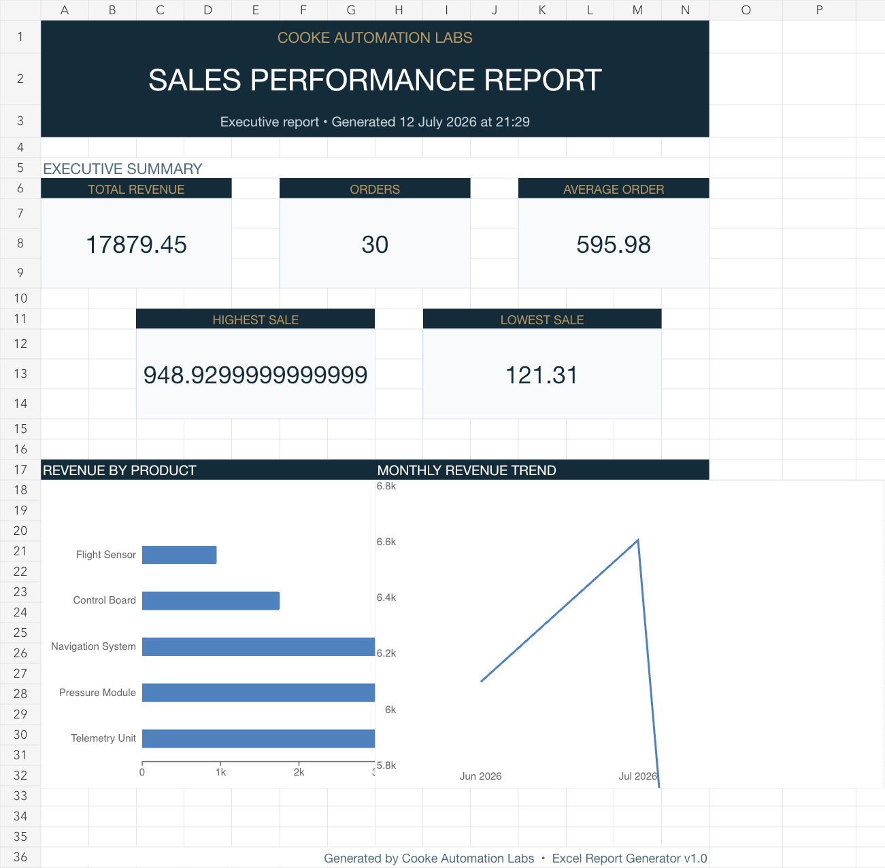

# Product 002 — Excel Report Generator


A local Python tool that converts raw sales data into a polished Excel report for executive review.



## What it produces

- Executive Summary with five KPI cards and two charts
- Auditable analysis tables by product, salesperson, region and month
- Filterable, formatted source-data table
- Report metadata and usage notes

## Run

```bash
python3 -m pip install -r requirements.txt
python3 generate_report.py
```

To use another file:

```bash
python3 generate_report.py path/to/sales.csv --output reports/My_Report.xlsx
```

The source CSV must contain: `order_id`, `date`, `customer`, `salesperson`, `product`, `region`, and `revenue`.

## Test

```bash
python3 -m unittest discover -s tests -v
```

The included v1.0 example workbook has been generated from the sample data and visually checked across all four worksheets.

Developed independently alongside an MEng Aerospace Engineering degree at UWE Bristol.
