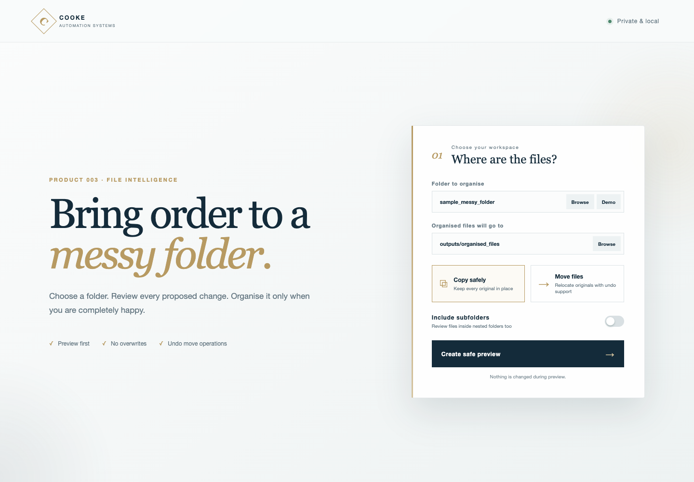
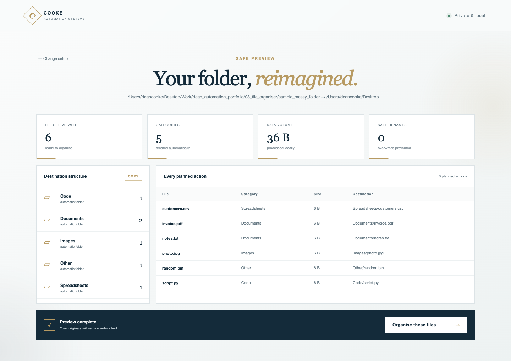
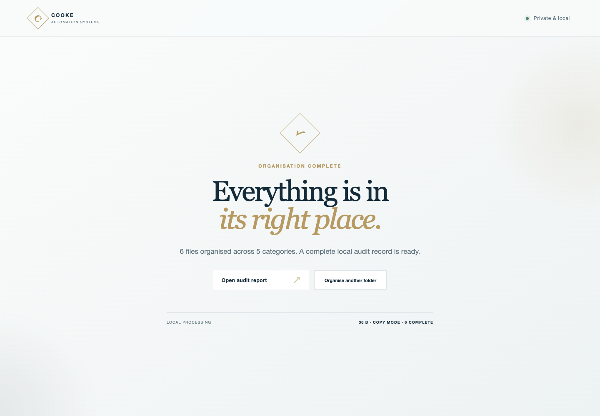
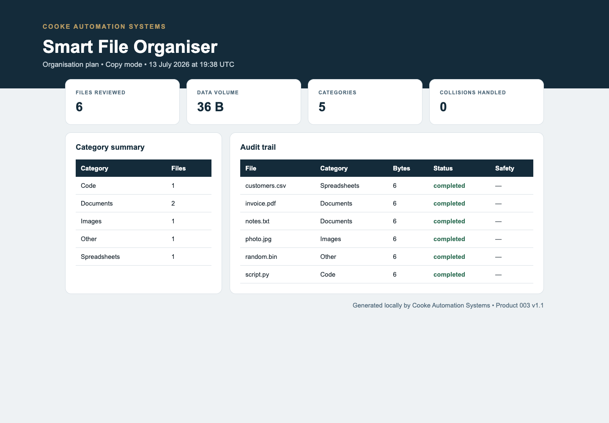

# Product 003 — Smart File Organiser


**Turn a chaotic folder into a clean, useful structure—without changing a single file until you approve the preview.**

The Smart File Organiser is a private local application for people who have Downloads folders, project handovers, client files or shared archives that have become difficult to navigate. It explains every proposed action in plain English, prevents filename overwrites and produces a complete audit record.



## Try it in under a minute

No third-party packages or online account are required. Python 3.10 or newer is recommended.

```bash
cd 03_file_organiser
python3 app.py
```

The application opens automatically in your browser. It runs only on `127.0.0.1`, so your files and file details stay on your computer.

To try the included example:

1. Click **Demo**.
2. Keep **Copy safely** selected.
3. Click **Create safe preview**.
4. Review the proposed folders and filenames.
5. Click **Organise these files** only when you are happy.

## What it produces

The app reads the chosen folder and creates sensible categories such as:

```text
Organised Files/
├── Documents/
├── Spreadsheets/
├── Images/
├── Video/
├── Audio/
├── Archives/
├── Code/
└── Other/
```

The preview shows the exact destination of every file before execution.



After approval, it produces:

| Result | Why it matters |
|---|---|
| `organised_files/` | The clean folder structure and organised files |
| `completed_manifest.json` | Machine-readable record of every action |
| `audit_report.csv` | A reviewable log that opens in Excel |
| `organisation_report.html` | A polished human-readable audit report |



The generated audit report is designed to be shared with a client, manager or project team when a traceable record is useful.



## How it makes life easier

- **No manual sorting:** file types are recognised and placed into useful categories.
- **No blind automation:** preview is compulsory before the interface can apply a plan.
- **No accidental overwrites:** duplicate names become safe names such as `report_2.pdf`.
- **No cloud upload:** processing happens locally and the server listens only on your computer.
- **No mystery:** every source, destination, category, file size and SHA-256 hash is recorded.
- **No permanent move mistakes:** move operations can be reversed from their completed manifest.

## Copy or move?

| Mode | Best for | Behaviour |
|---|---|---|
| **Copy safely** | First-time use, client handovers and valuable folders | Leaves every original untouched and builds an organised copy |
| **Move files** | Tidying a working folder after reviewing the preview | Relocates originals and records the information needed for undo |

The interface deliberately starts in **Copy safely** mode.

## Command-line use

The visual interface is recommended for most users. The same engine can also be automated from a terminal:

```bash
# Preview only — no files are changed
python3 run.py "/path/to/messy-folder" --destination "/path/to/organised-folder"

# Apply an approved copy plan
python3 run.py "/path/to/messy-folder" --destination "/path/to/organised-folder" --apply

# Include nested folders
python3 run.py "/path/to/messy-folder" --destination "/path/to/organised-folder" --recursive --apply

# Undo a completed move operation
python3 run.py --undo outputs/completed_manifest.json
```

Custom categories can be supplied with `--config config.example.json`.

## Engineering overview

This is not a cosmetic folder script. Product 003 separates the safety-critical engine from the user interface:

```text
Guided web interface
        ↓
OrganiserService — preview/apply/undo workflow
        ↓
Planning engine — validation, classification, hashing and collision handling
        ↓
JSON manifest + CSV audit + HTML report + organised folder
```

Notable implementation details:

- Standard-library local HTTP application with no external runtime dependencies
- Immutable `FileAction` and `OrganisationPlan` data models
- SHA-256 hashing in streamed 1 MB blocks
- Deterministic, collision-safe destination planning
- Separate preview and completed manifests
- Responsive Cooke Automation Systems interface
- Native folder chooser with a manual-path fallback
- Service layer that can be reused by a future desktop wrapper or API

## Tests

```bash
python3 -m unittest discover -s tests -v
```

The automated suite covers classification, safe copying, collision handling, rollback, unsafe destination rejection, non-destructive previews and the complete service workflow.

## Project map

```text
03_file_organiser/
├── app.py                 # Launches the local visual application
├── run.py                 # Command-line interface
├── src/
│   ├── engine.py          # Planning, execution and undo safety engine
│   ├── service.py         # Interface-facing workflow layer
│   └── report.py          # Branded audit report generator
├── web/                   # Luxury local interface
├── tests/                 # Automated verification
├── sample_messy_folder/   # Safe demonstration input
├── screenshots/           # Genuine application screenshots
└── outputs/               # Generated previews, reports and organised files
```

## Current scope

Version 1.1.0 is designed for local folders. It does not delete files, deduplicate content or synchronise with cloud storage. Those boundaries are deliberate: the current release focuses on transparent, reversible organisation.

---

**Cooke Automation Systems · Product 003 · Version 1.1.0**
