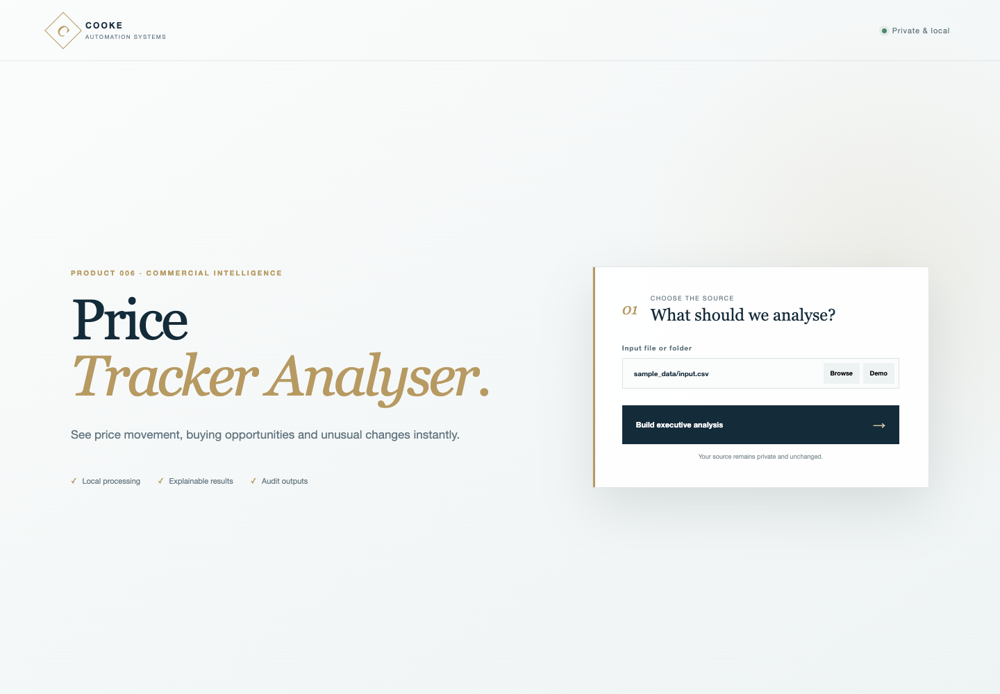
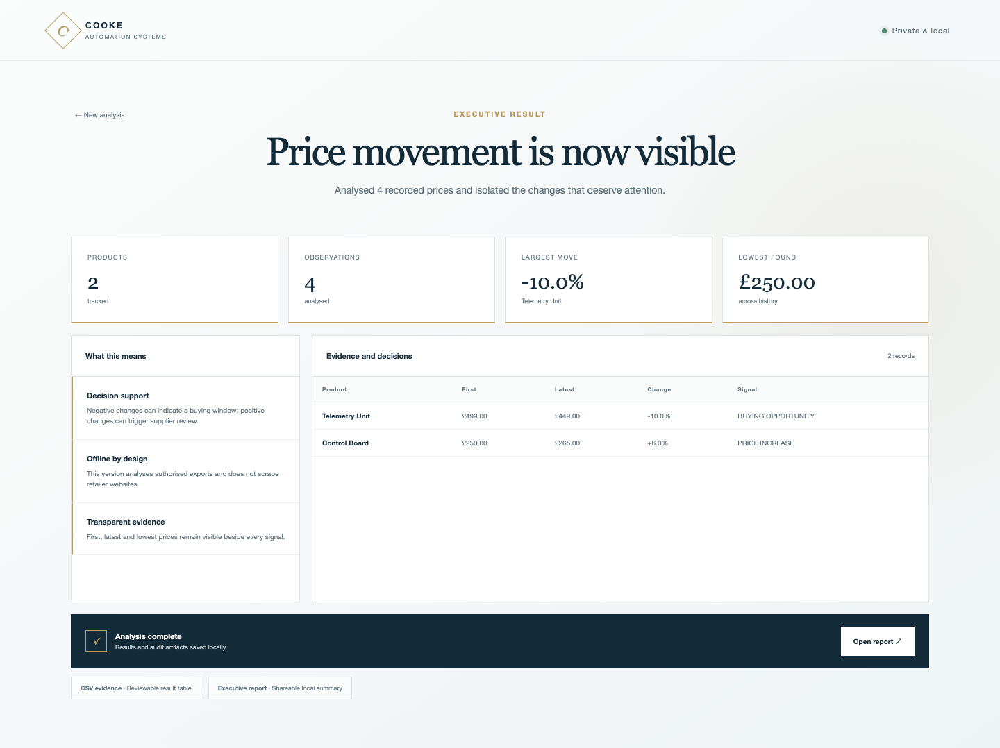

# Product 006 — Price Tracker Analyser


**See price movement, buying opportunities and unusual changes instantly.**

Price history exports are difficult to compare quickly across products and dates.

Product 006 turns that work into price-change rankings, first/latest/lowest comparisons, decision signals and executive artifacts. The visual application is designed for first-time users, while the underlying engine and audit artifacts remain useful to technical reviewers and recruiters.



## Try it in under a minute

From this product folder:

```bash
python3 app.py
```

The application opens automatically in your browser. It runs on `127.0.0.1`, processes the supplied input locally and starts with the included synthetic demonstration data.

1. Leave the demo path selected or choose your own authorised input.
2. Click **Build executive analysis**.
3. Review the KPIs, interpretation and evidence table.
4. Open the generated executive report or inspect the CSV/JSON artifacts.



## What the customer receives

- A guided Cooke Automation Systems interface
- Four executive KPI cards
- Plain-language interpretation of the result
- A detailed evidence table
- `outputs/executive_result.json` for systems and automation
- `outputs/executive_result.csv` for Excel and manual review
- `outputs/executive_report.html` for customers, managers and stakeholders

## Product capabilities

- Percentage change by product
- Lowest observed price identification
- Buying-opportunity and increase signals
- Authorised offline-export analysis

## Why it is safe and understandable

- The input path and purpose are visible before processing.
- Customer data stays on the local computer.
- The source input is preserved unless the interface explicitly presents an approval action.
- Calculations are supported by a visible evidence table rather than a hidden score alone.
- Synthetic sample data makes the complete workflow testable without exposing private information.

## Command-line workflow

The existing command-line entry point remains available for repeatable or scheduled work:

```bash
python3 run.py
```

The visual `app.py` workflow is recommended for customers and demonstrations. The command-line workflow is useful for developers, automation and batch processing.

## Engineering overview

```text
Guided local interface
        ↓
Product-specific analysis service
        ↓
Cooke Automation Systems calculation engine
        ↓
JSON + CSV + HTML evidence artifacts
```

The interface uses a standard-library local HTTP server and shared design system. Product behaviour remains product-specific: inputs are validated, calculations are transparent and outputs are generated from real engine results rather than static mock data.

## Verification

```bash
(cd .. && python3 -m unittest discover -s tests -v)
```

The portfolio verification suite runs every product against its included sample input and checks that the application returns metrics, evidence rows and real output artifacts. Product-specific engines retain their own additional tests where present.

## Project map

```text
06_price_tracker_demo/
├── app.py          # Guided local application
├── run.py          # Command-line workflow
├── sample_data/    # Synthetic demonstration input
├── outputs/        # Generated evidence and deliverables
├── screenshots/    # Genuine interface screenshots
└── README.md       # Customer and engineering guide
```

---

**Cooke Automation Systems · Product 006 · Version 2.0.0**
