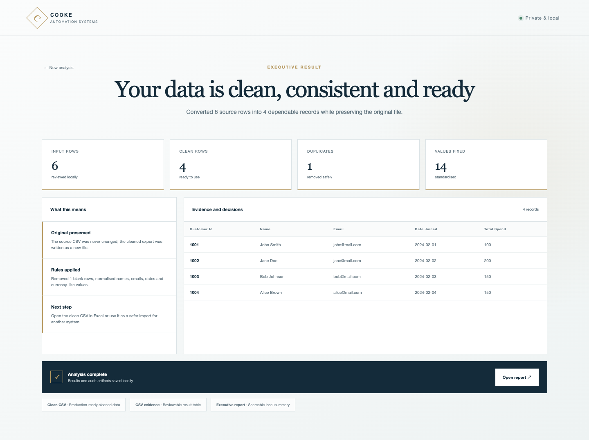
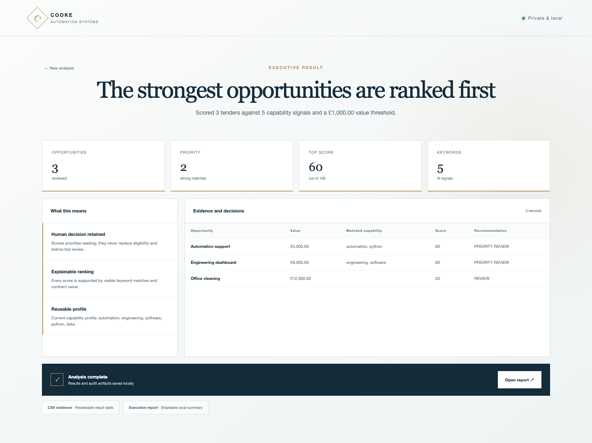
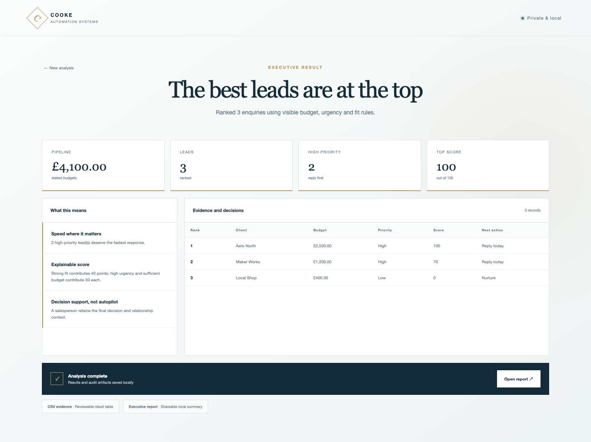

# Cooke Automation Systems


**Twenty private, practical automation products built to turn repetitive work into clear decisions and professional deliverables.**

This repository is both a customer-facing product catalogue and the public engineering portfolio of Dean Cooke, developed independently alongside an MEng Aerospace Engineering with Pilot Studies degree at UWE Bristol.

Every product now includes a guided local interface, real calculations, synthetic demonstration data, verified outputs, screenshots, plain-language documentation and automated checks.

<table>
<tr>
<td></td>
<td></td>
</tr>
<tr>
<td></td>
<td></td>
</tr>
</table>

## What makes these products different

- **Simple to start:** run `python3 app.py` inside any product folder.
- **Private by design:** applications bind to `127.0.0.1` and process data locally.
- **Explainable:** decisions are supported by visible rules, metrics and evidence tables.
- **Auditable:** products generate JSON, CSV and branded HTML artifacts; specialist tools also produce Excel or ZIP deliverables.
- **Safe:** source files are preserved by default, and file-changing workflows require preview or explicit approval.
- **Consistent:** every interface uses the Cooke Automation Systems navy, warm gold, pearl and steel design language.
- **Verified:** real demonstration runs and automated tests exercise every product engine.

## Product catalogue

| No. | Product | Customer outcome |
|---:|---|---|
| 001 | [Messy CSV Cleaner](01_messy_csv_cleaner) | Produces dependable import-ready data and a complete cleaning record |
| 002 | [Excel Report Generator](02_excel_report_generator) | Builds a four-sheet executive sales workbook with charts and audit data |
| 003 | [Smart File Organiser](03_file_organiser) | Previews and applies safe, collision-proof folder organisation |
| 004 | [Invoice Renamer](04_invoice_renamer) | Creates searchable finance filenames through an approval-first plan |
| 005 | [Versioned Backup Tool](05_folder_backup_tool) | Produces a verified ZIP with an embedded integrity manifest |
| 006 | [Price Tracker Analyser](06_price_tracker_demo) | Turns authorised price history into changes and buying signals |
| 007 | [Tender Opportunity Scorer](07_tenderscout_case_study) | Ranks opportunities using visible capability and value evidence |
| 008 | [Duplicate File Finder](08_duplicate_file_finder) | Finds exact duplicate content and quantifies reclaimable storage |
| 009 | [Document Pack Builder](09_document_pack_builder) | Combines scattered notes into an ordered, traceable review pack |
| 010 | [Image Library Auditor](10_image_library_auditor) | Catalogues assets, fingerprints content and proposes consistent names |
| 011 | [Log Insight Analyser](11_log_insight_analyser) | Converts operational logs into a severity and recurring-issue briefing |
| 012 | [Data Quality Auditor](12_data_quality_auditor) | Measures completeness, duplicates and a repeatable quality baseline |
| 013 | [Quote Builder](13_quote_builder) | Calculates itemised pricing, tax and verified final totals |
| 014 | [Expense Categoriser](14_expense_categoriser) | Produces explainable spending categories and transaction evidence |
| 015 | [Inventory Reorder Planner](15_inventory_reorder_planner) | Recommends purchasing quantities from demand, lead time and safety stock |
| 016 | [Schedule Conflict Checker](16_schedule_conflict_checker) | Identifies exact overlapping commitments and total conflict time |
| 017 | [Folder Change Monitor](17_folder_change_monitor) | Creates cryptographic baselines and reports added, changed or removed files |
| 018 | [Client Handover Packager](18_client_handover_packager) | Validates and seals a delivery ZIP with checksum evidence |
| 019 | [Service SLA Dashboard](19_service_sla_dashboard) | Exposes compliance, breaches and service-resolution performance |
| 020 | [Client Lead Ranker](20_client_lead_ranker) | Prioritises pipeline attention using explainable fit, budget and urgency |

## Run a product

```bash
cd 07_tenderscout_case_study
python3 app.py
```

The browser opens automatically. Choose the included demo or select an authorised input, run the analysis and inspect the generated outputs inside that product's `outputs/` folder.

Command-line entry points remain available through each product's `run.py` or specialist script.

## Engineering architecture

```text
Cooke Automation Systems catalogue
├── Shared product studio
│   ├── Local application server
│   ├── Consistent interface and reporting layer
│   └── Native input selection
├── Product-specific services
│   ├── Validation and calculations
│   ├── Safe file workflows
│   └── Executive interpretation
├── Specialist standalone engines
│   ├── Product 002 Excel reporting framework
│   └── Product 003 preview/apply/undo organiser
└── Verification
    ├── Full-catalogue runtime tests
    ├── Product-specific unit tests
    └── Browser-driven screenshot and workflow checks
```

The shared application layer keeps the customer experience consistent without reducing every product to the same calculation. Each product has its own inputs, rules, KPIs, evidence and deliverables.

## Verify everything

From the repository root:

```bash
python3 -m unittest discover -s tests -v
python3 -m unittest discover -s 01_messy_csv_cleaner/tests -v
(cd 02_excel_report_generator && python3 -m unittest discover -s tests -v)
(cd 03_file_organiser && python3 -m unittest discover -s tests -v)
```

## Safety and scope

- Sample inputs are synthetic.
- No application transmits customer data.
- Analytical products preserve their source inputs.
- Invoice renaming and file organisation require an explicit approval workflow.
- Duplicate detection reports candidates but never deletes files.
- Reports are decision support; customers retain final commercial, legal and operational judgement.

---

**Cooke Automation Systems · Engineering software with quiet confidence**
